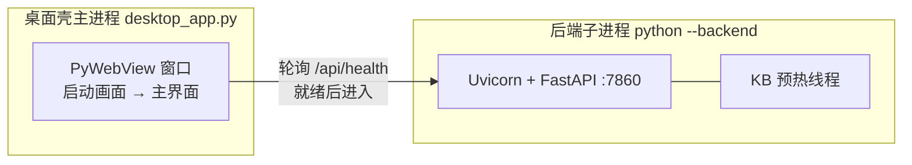
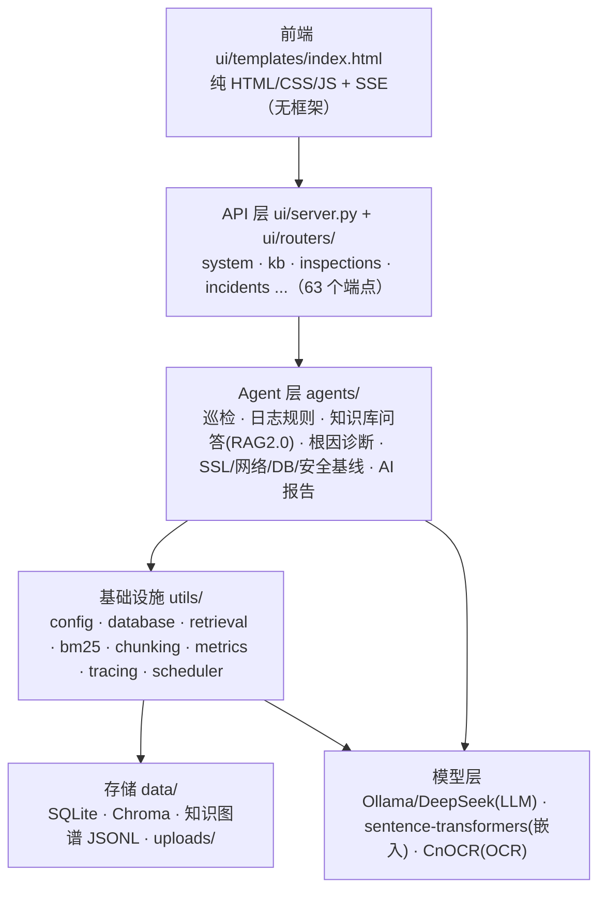
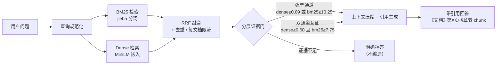
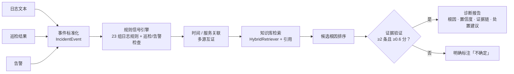

# 架构说明（ARCHITECTURE.md）

> 面向开发者的架构总览：运行形态、处理链、关键机制与扩展点。
> 配套阅读：README（快速开始）· [docs/API.md](docs/API.md)（接口）· [docs/SECURITY.md](docs/SECURITY.md)（安全）· [docs/reports/](docs/reports/)（评测）

## 1. 运行形态（同一套代码，三种交付）

| 形态 | 入口 | 说明 |
|---|---|---|
| 源码 Web | `python main.py` | FastAPI + 浏览器访问 `:7860` |
| 桌面版 | `desktop_app.py` | PyWebView 原生窗口；**GUI 主进程 + 后端子进程（`--backend`）双进程隔离** |
| 绿色版 | `OA运维Agent.exe` | PyInstaller 冻结壳 + 外置 `app/` 业务代码（更新免重打包） |

**为什么桌面版是双进程**：WebView2 与 torch/onnxruntime 在同一进程加载会触发原生崩溃（0xc0000409）。把后端拆到独立子进程后问题消失：主进程只负责窗口，后端可独立重启，崩溃互不拖累。



## 2. 分层总览



## 3. RAG 2.0 检索链（第 2~3 周）



- 阈值由 128 条评测集网格校准、holdout 冻结（`config.yaml → knowledge_base.retrieval.thresholds`）；改动阈值前必须复跑评测。
- 两种预设：`lite`（默认，随绿色版分发）/ `quality`（BGE-M3 + Reranker，模型单独下载）。
- Agentic RAG：LangGraph ReAct 多步（检索 → 回答），最大步数可配置；回答级拒答契约兜底。

## 4. 智能根因诊断管线（第 4 周）



- **只读**：诊断不执行任何修复动作；报告由 `utils/incident_models.py` 模型层强制校验（证据不足不许出根因、不许强凑）。
- 同一检索引擎、不同场景配置：问答链用冻结阈值；诊断侧放开门（引用召回优先）。
- 接口：`POST /api/v1/incidents/analyze` 等 v1 端点（见 docs/API.md）；UI 从日志/巡检页一键发起。

## 5. 启动就绪机制（KB 状态机）

- 启动即后台线程预热嵌入模型与知识库：`loading → ready / unavailable`（unavailable 为粘性终态，不随请求重试）。
- `/api/health` 上报 `kb_state` / `kb_error`；桌面壳启动画面等待就绪（超 8 秒可点「跳过」）；前端每 2 秒轮询、未就绪时拦截提问。
- 首次加载嵌入模型约 20~40 秒（缓存后 3~5 秒）。

## 6. 可观测与安全（第 5 周）

中间件栈（starlette「后加 = 更外层」），实际请求顺序：

```text
请求 → RequestContext（request-id）→ Metrics（Prometheus）→ AuthGate（认证/RBAC，回环旁路）→ 路由
```

- 日志：`OA_LOG_FORMAT=json` 输出 JSON Lines（含 request-id、密钥脱敏）；默认 text。
- 指标：`/metrics`（Prometheus 文本格式，手写原语、零新硬依赖）。
- 追踪：`OA_TRACING=1` 启用 OpenTelemetry（未安装 SDK 自动降级 no-op）。
- 认证：Session + PBKDF2 哈希 + 登录限速 + RBAC（admin/viewer）；非回环 + 默认密码 → 拒绝启动（启动安全门禁）。
- 细节与实测见 [docs/SECURITY.md](docs/SECURITY.md)。

## 7. 数据与存储

| 存储 | 位置 | 内容 |
|---|---|---|
| SQLite | `data/oa_ops.db` | 对话历史、巡检记录、诊断报告、审计事件 |
| Chroma | `data/chroma_db` | 知识库向量（语义切块，chunk_uid） |
| BM25 索引 | 内存缓存（语料变更自动失效重建） | jieba 分词倒排 |
| 知识图谱 | `data/knowledge_graph/` | NetworkX 图 + JSONL 持久化 |
| 文件 | `data/uploads/` | 上传文档与报错截图 |

## 8. 扩展点（开发者）

| 想做什么 | 改哪里 |
|---|---|
| 新增日志故障规则 | `agents/log_analysis_agent.py → FAULT_RULES`（正则 + 建议，纯确定性） |
| 新增诊断信号规则 | `agents/incident_rules.py`（23 组 LOG_RULES + 巡检/告警检查） |
| 新增 API 端点 | `ui/routers/` 扩展路由 → `ui/server.py` 注册；同步 `docs/API.md` |
| 调整检索阈值 | `config.yaml → knowledge_base.retrieval.thresholds`（改前先复跑 evals） |
| 新增评测 | `evals/`：语料 → 标注集 / 案例 → 运行器 → 报告 |
| 打包 / 更新绿色版 | `scripts/打包绿色版.bat` / `scripts/更新绿色版代码.bat`（业务代码走 app/ 外置） |

## 9. 工程与质量门

- CI（`.github/workflows/quality.yml`）：quality（Ruff ×2 / Pyright / pytest / 覆盖率 / compileall）+ docker-core（镜像构建 + 健康冒烟）。
- 本地等价：`uv sync --locked --dev && uv run pytest --cov && uv run ruff check . && uv run pyright`。
- 测试约定：全离线运行、mock 外部边界、禁外部网络（仅本机回环允许）。
- 版本节奏：每阶段独立分支 + PR（见 CHANGELOG.md 的 v3.0.0「六周工程」）。
