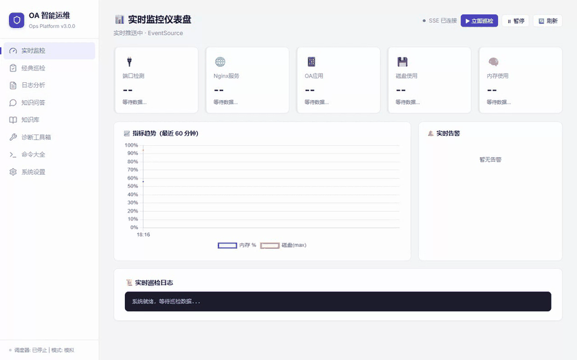
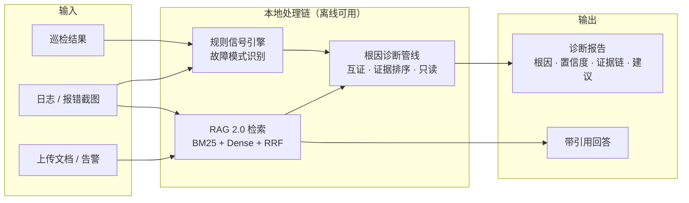

# OA 智能运维 Agent · v3.0.0

> **本地优先的企业 OA 智能运维与根因诊断平台** —— 巡检、日志分析、RAG 知识库问答、智能根因诊断，一站式离线运行。Windows 绿色版免装 Python，数据不出本机。
>
> *Local-first AIOps assistant & root-cause diagnosis platform for OA systems. Fully offline (Ollama); Windows portable build included.*

[](https://www.python.org/downloads/)
[](LICENSE)
[](https://github.com/BYYQ778/OA-ops-agent/actions/workflows/quality.yml)
[](https://github.com/BYYQ778/OA-ops-agent/releases)



*上图为动态演示 GIF；完整 74 秒演示视频（含巡检与指标页）见 [docs/assets/demo.mp4](docs/assets/demo.mp4)*

---

## 30 秒了解

**解决什么问题？** 中小企业的 OA 系统（Tomcat + MySQL/Oracle/SQL Server 那套）日常出故障时，往往没有专业监控栈：排查靠人肉翻日志、查文档、凭经验。本项目把「**巡检 → 日志/告警 → 知识库 → 根因诊断**」串成一条自动化链路：

- 每条结论**必须带证据**（规则信号 + 知识库引用），证据不足时明确标注「不确定」，**禁止凭空猜根因**；
- 诊断**只读**：只给分析和建议，不自动执行修复命令；
- 全链路可本地离线运行（Ollama + 本地嵌入模型），数据不出本机；也可切换云端大模型增强。

**核心能力**

| 能力 | 说明 |
|---|---|
| 🧠 **智能根因诊断** | 日志/巡检/告警 → 标准化事件 → 知识库互证 → 根因 + 置信度 + 证据链 + 处置建议；日志/巡检页「一键根因分析」 |
| 📚 **RAG 2.0 知识库问答** | BM25 + Dense 混合检索 → RRF 融合 → 分层证据门 → 带引用回答（精确到《文档》·章节·chunk）；无证据明确拒答；Agentic RAG 多步推理 |
| 🔍 **实时监控仪表盘** | SSE 实时推送 + 5 状态卡片 + Chart.js 趋势图 + 告警时间线 + 终端日志控制台 |
| 🩺 **巡检监控** | 端口/服务/磁盘/内存检测，Local/SSH/Simulated 三种模式，定时调度 + 历史查询 + AI 报告 |
| 📋 **日志分析** | 14 类常见故障正则规则（502/503/OOM/磁盘满/Oracle 表空间/SQLServer 事务日志满等）纯确定性分析（不依赖 LLM）；支持上传报错截图 OCR 识别 |
| 🛠 **诊断工具箱** | SSL 证书检测、网络诊断（Ping/端口/DNS/路由/HTTP）、数据库巡检（MySQL/MSSQL/Oracle/Redis）、安全基线审计 |
| 📈 **可观测与安全** | 结构化 JSON 日志（request-id + 密钥脱敏）、Prometheus 指标、OpenTelemetry 追踪（可选零依赖降级）、Session 登录 + RBAC + 启动安全门禁 |

**架构一览**（详版见 [ARCHITECTURE.md](ARCHITECTURE.md)）：



## 实测结果（全部可复现，报告见 `docs/reports/`）

### RAG 2.0 vs 旧版（128 条标注评测集 · 同一语料 / 同一硬件 / 同一嵌入模型）

| 指标 | 旧版（纯向量） | 新版（混合检索） | Δ |
|---|---|---|---|
| **Recall@5** | 74.1% | **94.4%** | +20.4pp |
| MRR | 0.609 | 0.807 | +0.198 |
| NDCG@5 | 0.639 | 0.841 | +0.203 |
| 引用覆盖率 | 74.1% | **98.1%** | +24.0pp |
| 引用准确率 | 48.1% | 76.9% | +28.8pp |
| 无证据拒答率 | 0.0% | **75.0%**（dev 84.6%） | +75.0pp |
| 误拒率（可回答） | 0.0% | 3.7% | +3.7pp |


LLM 端到端子集（30 题真实 Agent 跑）：系统级无证据拒答率 **100%**、工具选择 100%、失败率 0%。
完整口径与复现命令：[docs/reports/rag-eval-report.md](docs/reports/rag-eval-report.md)

### 智能根因诊断（35 条标准案例）

| 验收标准 | 实测 |
|---|---|
| 案例 ≥30 条 | 35 条（dev 25 / holdout 10） |
| Top-1 根因准确率 ≥80% | **30/30 = 100%** |
| 报告含根因+置信度+≥2 证据+建议 | 完整性违规 **0** |
| 证据不足标「不确定」 | 5/5 正确 |
| 平均判定耗时 | 198ms/案例 |

口径声明（合成案例集，非生产数据）与改进路径：[docs/reports/incident-rca-report.md](docs/reports/incident-rca-report.md)

### 根因诊断长什么样（真实案例 c003 · 评测实跑）

**输入**（多源信号，来自标准案例集）：

```text
[日志] 2026-09-18 10:02:11 [ERROR] No space left on device - /var/log/messages
[日志] 2026-09-18 10:02:30 [WARN]  log rotate skipped: disk full
[日志] 2026-09-18 10:02:45 [INFO]  系统进入只读模式
[巡检] [告警] /var: 使用率 94% (超过阈值85%)
```

**输出**（诊断报告摘要）：

```text
根因：磁盘写满（disk_full）      Top-1 命中 ✓
证据链：6 条 —— 3 条规则信号（多源互证）+ 3 条知识库引用
判定耗时：171ms（全流程确定性，零 LLM）
建议：处置步骤与引用来自知识库（日志轮转检查 / 大文件清理 / 扩容或迁移数据目录），随报告一并给出
```

> 在「日志分析」或「巡检」页面点击「**一键根因分析**」即可复现；接口见下文 API 快速索引。

### 工程可信度

| 项 | 实测 |
|---|---|
| 单元测试 | **927 passed**（全离线，不连外部服务） |
| 覆盖率 | 全库 **81%**（如实统计，不含业务代码排除项） |
| 静态检查 | Ruff 全库 + 严格范围（E/F/I/W）、Pyright 0 errors、compileall |
| CI | GitHub Actions 双作业：quality（Lint/类型/测试/覆盖率）+ docker-core（镜像构建 + 健康冒烟），全绿 |
| 测试独立性 | 测试禁止外部网络，只允许本机回环；模型不下载 |

## 快速开始

**无需 API Key，开箱即用。** 默认本地离线模式（Ollama），所有数据不出本机。

### 方式一：绿色版（推荐，免装任何环境）

从 [Releases](https://github.com/BYYQ778/OA-ops-agent/releases) 下载 `OA运维Agent-v3.0.0-win64.zip` 解压即可（约 1.7GB，内含离线模型）：

- `OA运维Agent.exe` 双击即开，**无需安装 Python / 依赖 / Ollama**
- 内置离线嵌入模型与 OCR 模型（完全离线可用）
- 业务代码外置在 exe 同目录 `app/`：更新代码只需跑 `scripts/更新绿色版代码.bat`，无需重新打包
- 数据（知识库/对话/巡检/日志）在 exe 同目录 `data/`，整个文件夹可整体拷贝分发

### 方式二：Windows 一键启动（源码）

双击项目根目录 `scripts/启动.bat`（自动检查环境 → 检测/安装 Ollama → 拉取 qwen3:8b → 装依赖 → 启动浏览器）。

或手动三步：

```bash
git clone https://github.com/BYYQ778/OA-ops-agent.git
cd oa-ops-agent
pip install -r requirements.txt
python main.py          # 启动后访问 http://127.0.0.1:7860
```

### 方式三：桌面版（源码，原生窗口）

运行 `scripts/启动桌面版.bat`（PyWebView + Edge WebView2 原生窗口，关闭即退出，无残留进程）。

### 方式四：Docker

```bash
docker-compose up -d
```

### 想用云端大模型？

默认本地 Ollama。想用 DeepSeek：复制 `.env.example` 为 `.env` 填入 `OA_LLM_API_KEY=sk-...`，再把 `config.yaml` 的 `llm.provider` 改为 `deepseek` 即可。

### 演示模式（完全离线，不需要 Ollama）

```bash
python main.py --demo
```

仅使用模拟数据 + 本地正则分析，不依赖任何外部服务。

### 本地开发与验证

项目使用 `pyproject.toml + uv.lock` 锁定依赖（CI 与本地一致）：

```bash
uv sync --locked --dev              # core + 开发工具（CI 默认）
uv sync --locked --all-extras --dev # 完整源码环境（RAG + OCR + 桌面）

uv run pytest --cov --cov-report=term-missing   # 927 passed（全离线）
uv run ruff check . && uv run pyright
uv run pre-commit run --all-files
```

测试和轻量容器可设置 `OA_ENABLE_BACKGROUND_STARTUP=0`（跳过启动探测/预热）；`OA_DATA_DIR` 可隔离数据目录。

## API 快速索引

- **v1 诊断接口**：`POST /api/v1/incidents/analyze`（提交日志/巡检/告警 → 诊断报告）、`GET /api/v1/incidents/{id}`、`POST /api/v1/rag/query`（结构化检索）、`GET /api/v1/evals/latest`、`GET /metrics`（Prometheus）
- **兼容接口**：知识库 `/api/kb/*`（16 个：导入/删除/问答/流式/对话历史/批量）、巡检 `/api/inspect/*`、日志 `/api/log/*`、监控 `/api/dashboard/*`、诊断工具（`/api/ssl` `/api/net` `/api/db` `/api/sec`）等，共 **63 个 API 端点**
- 完整交互式文档：启动后访问 `http://127.0.0.1:7860/docs`（FastAPI Swagger UI）；逐项说明见 [docs/API.md](docs/API.md)

## 配置

### 巡检模式

```yaml
inspection:
  mode: local          # local | ssh | simulated | auto
```

| 模式 | 说明 |
|------|------|
| `local` | 本机检测（Windows：端口 / 服务 / 磁盘 / 内存） |
| `ssh` | 远程 Linux 服务器（paramiko） |
| `simulated` | 随机模拟数据，无需外部依赖 |
| `auto` | SSH 优先 → 本机 → 模拟，逐级降级 |

### 知识库与 RAG 2.0

```yaml
knowledge_base:
  # RAG 2.0 混合检索（BM25 + Dense + RRF，证据不足明确拒答）
  retrieval:
    mode: lite                 # lite（默认，随绿色版分发）| quality（BGE-M3 + Reranker，模型单独下载）
    hybrid_enabled: true
    final_top_k: 5
    thresholds:
      # 由 128 条评测集校准、holdout 冻结（第 3 周）——分层证据门
      min_dense_similarity: 0.89    # 单通道强证据
      min_bm25_score: 10.25
      joint_dense_similarity: 0.60  # 双通道互证
      joint_bm25_score: 7.75
  chunking:
    strategy: semantic          # 标题/段落/页级语义切块（fixed 为旧固定字符切块）
  agentic_rag:
    enabled: true               # LangGraph ReAct 多步推理
```

### LLM 后端

```yaml
llm:
  provider: ollama           # ollama（默认，离线）| deepseek | qwen | openai
  ollama:
    model: qwen3:8b
```

### 环境变量（.env）

| 变量 | 说明 | 默认值 |
|------|------|--------|
| `OA_LLM_API_KEY` | DeepSeek / 千问 / OpenAI API Key | — |
| `OA_AUTH_PASSWORD` | Web 登录密码（**非回环部署必须设置非默认值，否则拒绝启动**） | （空，本机回环免登录） |
| `OA_LOG_FORMAT` | 日志格式：`text` / `json`（JSON Lines，含 request-id） | `text` |
| `OA_TRACING` | 启用 OpenTelemetry 追踪（需 `pip install opentelemetry-sdk`，未装自动降级） | 关闭 |
| `OA_SSH_PASSWORD` | SSH 巡检密码 | — |
| `OA_EMAIL_USER` / `OA_EMAIL_PASSWORD` | 告警邮箱 / SMTP 授权码 | — |

> 密钥只放在 `.env`（已 gitignore）；`config.yaml` 只允许 `${VAR:}` 占位引用，仓库内不含任何明文密钥。

## 目录结构（关键部分）

```
oa-ops-agent/
├── main.py                    # 入口（--demo / --cli / --port）
├── desktop_app.py             # 桌面壳（PyWebView + 后端子进程）
├── oa_agent.spec              # PyInstaller 打包配置（绿色版）
├── config.yaml                # 主配置
├── agents/                    # 领域 Agent（15 个模块）
│   ├── incident_agent.py      #   根因诊断管线（只读）
│   ├── incident_rules.py      #   23 类信号规则（日志/巡检/告警）
│   ├── incident_kb.py         #   知识库适配器（引用进证据链）
│   ├── knowledge_agent.py     #   RAG 2.0 问答 + Agentic RAG
│   ├── inspection_real.py     #   真实巡检（Local/SSH）
│   ├── log_analysis_agent.py  #   日志分析（纯正则规则库）
│   └── ...                    #   SSL/网络/数据库/安全基线/AI 报告
├── utils/                     # 基础设施（23 个模块）
│   ├── bm25.py / retrieval.py #   BM25 / RRF 混合检索 / 分层证据门
│   ├── chunking.py            #   语义切块
│   ├── structured.py          #   Pydantic 结构化路由
│   ├── incident_models.py     #   事件/证据/诊断报告数据模型
│   ├── metrics.py             #   Prometheus 指标原语
│   └── ...                    #   配置/数据库/调度/解析/OCR/知识图谱
├── ui/
│   ├── server.py              # FastAPI 主服务
│   ├── routers/               # 按域拆分（kb / inspections / incidents ...）
│   ├── templates/index.html   # 纯 HTML/CSS/JS 前端（无框架）
│   └── static/                # 样式 / 命令库 / 本地化图表库
├── evals/                     # 评测体系（语料 24 篇 + 128 条标注集 + 35 案例 + 运行器）
├── tests/                     # pytest 套件（43 个文件 / 927 用例）
└── docs/                      # 文档（架构/变更/API/安全/评测报告，见下）
```

## 技术栈

| 组件 | 用途 |
|------|------|
| FastAPI + Uvicorn | Web 服务端（63 个 API 端点，SSE 流式） |
| LangChain / LangGraph | Agent 编排、Agentic RAG 多步推理 |
| Chroma + BM25(jieba) | 向量 + 关键词混合检索（RRF 融合） |
| sentence-transformers | 文档嵌入（paraphrase-multilingual-MiniLM-L12-v2） |
| NetworkX | 知识图谱（实体关系可视化） |
| SQLite | 数据持久化（会话/巡检/诊断/审计） |
| Ollama / DeepSeek | LLM 双轨（本地离线优先 / 云端可选） |
| PyWebView + PyInstaller | 桌面版与绿色版分发 |
| OpenTelemetry / Prometheus | 可观测性（可选依赖，自动降级） |

## 常见问题

**Q: 需要付费吗？需要 API Key 吗？**
A: 都不需要。默认使用本地 Ollama 大模型，完全免费，数据不出本机。

**Q: 根因诊断需要大模型吗？会不会乱猜？**
A: 不依赖 LLM。候选根因来自**规则信号 + 知识库引用**的确定性管线，报告强制携带证据链（≥2 条），证据不足时明确标注「不确定」；且只读——不会自动执行任何修复命令。

**Q: 登录认证怎么工作？部署到局域网/公网要注意什么？**
A: 本机回环访问（桌面版/本机浏览器）免登录直通；非回环客户端必须登录（`.env` 的 `OA_AUTH_PASSWORD`，或 `config.yaml` 的 `auth.users` 配置多用户 + `admin/viewer` 角色，密码哈希用 `python scripts/hash_password.py` 生成）。绑定 `0.0.0.0` 等非回环地址时未设置非默认密码会**拒绝启动**（启动安全门禁）。HTTPS 部署把 `auth.cookie_secure` 设为 `true`。细节见 [docs/SECURITY.md](docs/SECURITY.md)。

**Q: 启动后页面空白或加载慢？**
A: 首次运行需加载/下载嵌入模型（约 118MB），等待片刻即可；桌面版启动画面会在服务就绪后自动进入（超 8 秒可点「跳过等待」）。

**Q: 巡检显示"模拟数据"？**
A: 在 `config.yaml` 将 `inspection.mode` 改为 `local`（本机）或 `ssh`（远程）。

**Q: 可以部署到 Linux 服务器吗？**
A: 可以。安装 Python 3.11+，按需安装 Ollama；巡检用 `ssh` 模式指向目标主机。Docker 方式已提供。

## 文档索引

| 文档 | 内容 |
|---|---|
| [ARCHITECTURE.md](ARCHITECTURE.md) | 架构与数据流（三形态 / 双进程 / RAG 链 / RCA 管线 / 观测与安全） |
| [CHANGELOG.md](CHANGELOG.md) | 版本变更记录（v2.5 → v3.0.0） |
| [docs/API.md](docs/API.md) | API 端点说明与示例 |
| [docs/SECURITY.md](docs/SECURITY.md) | 安全设计（认证/RBAC/密钥隔离/防注入/部署基线） |
| [docs/reports/rag-eval-report.md](docs/reports/rag-eval-report.md) | RAG 评测报告（新旧对比 + 阈值校准） |
| [docs/reports/incident-rca-report.md](docs/reports/incident-rca-report.md) | 根因诊断评测报告（35 案例） |
| [docs/reports/week5-security-observability-report.md](docs/reports/week5-security-observability-report.md) | 可观测性与安全实测报告 |
| [docs/Ollama离线部署指南.md](docs/Ollama离线部署指南.md) | 内网/离线环境部署 |

## License

MIT
