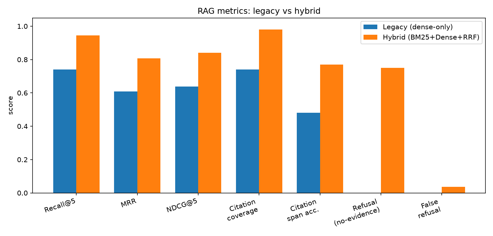
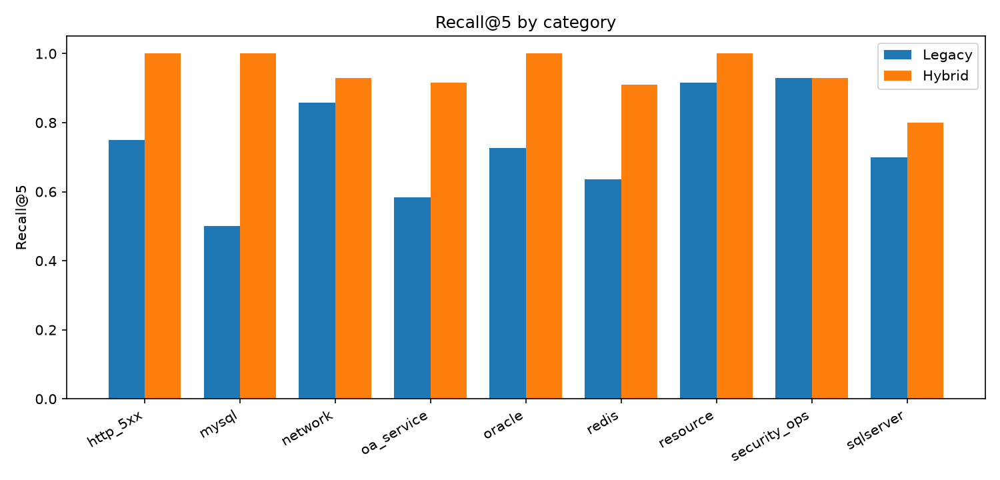
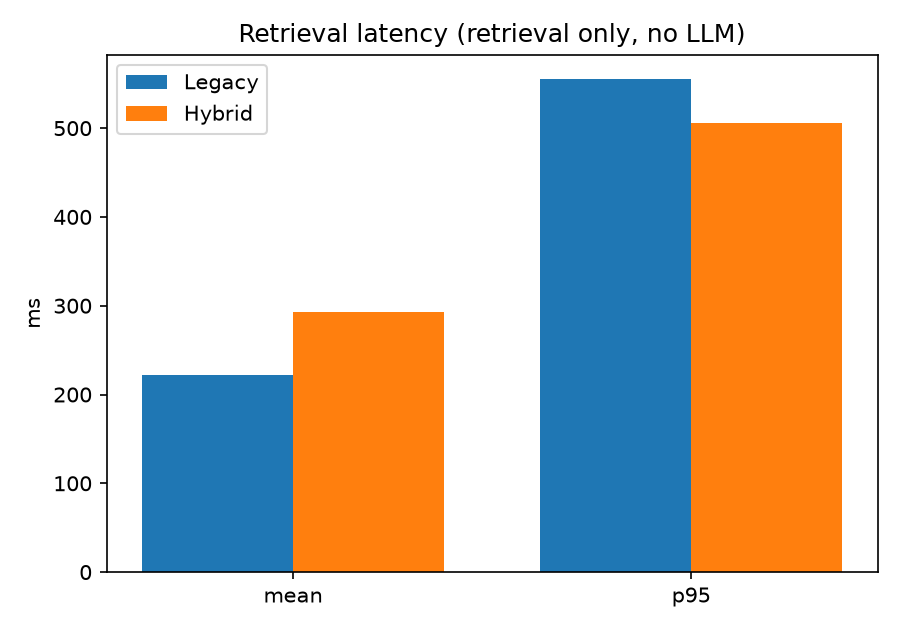
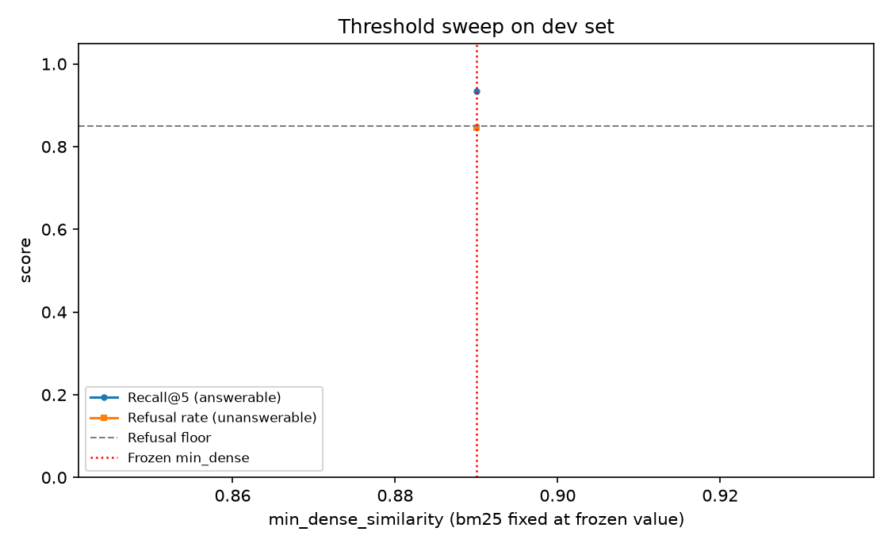

# RAG 检索评测报告（第 3 周 · feat/rag-evaluation）

本报告由 `scripts/gen_report.py` 从评测结果 JSON 自动生成；评测对象为 OA 智能根因诊断平台的检索链升级（RAG 2.0：BM25 + Dense + RRF + 阈值拒答）。

## 一、评测设置

- 数据：`24` 篇合成运维文档（公开安全），语义切块 222 块 / 旧版固定切块 118 块；
- 评测集：128 条（split=all），其中无证据负例按类别分布；
- 两版共用同一嵌入模型（paraphrase-multilingual-MiniLM-L12-v2）与同一硬件（Intel64 Family 6 Model 151 Stepping 2, GenuineIntel，24 核，Python 3.11.9）；
- 新版阈值：强证据 dense≥0.89 或 bm25≥10.25；互证 dense≥0.6 且 bm25≥7.75（dev 校准后冻结）；`rerank: False`（重排序模型未下载，未纳入本轮）；
- 说明：解析层不参与对比（两版读取同一原文）；BM25 分词器：jieba；评测时间 2026-09-17T20:13:35。

## 二、总体结果

| 指标 | 旧版（dense-only） | 新版（hybrid） | Δ |
|---|---|---|---|
| Recall@5 | 74.1% | 94.4% | +20.4pp |
| MRR | 0.609 | 0.807 | +0.198 |
| NDCG@5 | 0.639 | 0.841 | +0.203 |
| 引用覆盖率 | 74.1% | 98.1% | +24.0pp |
| 引用准确率（span） | 48.1% | 76.9% | +28.8pp |
| 无证据拒答率 | 0.0% | 75.0% | +75.0pp |
| 误拒率（可回答） | 0.0% | 3.7% | +3.7pp |
| 延迟 mean (ms) | 222.0 | 292.8 | +70.8 |
| 延迟 P95 (ms) | 555.2 | 505.9 | -49.3 |




## 三、分类别 Recall@5

| 类别 | 旧版 Recall@5 | 新版 Recall@5 | Δ |
|---|---|---|---|
| http_5xx | 75.0% | 100.0% | +25.0pp |
| mysql | 50.0% | 100.0% | +50.0pp |
| network | 85.7% | 92.9% | +7.1pp |
| oa_service | 58.3% | 91.7% | +33.3pp |
| oracle | 72.7% | 100.0% | +27.3pp |
| redis | 63.6% | 90.9% | +27.3pp |
| resource | 91.7% | 100.0% | +8.3pp |
| security_ops | 92.9% | 92.9% | +0.0pp |
| sqlserver | 70.0% | 80.0% | +10.0pp |




## 四、延迟

延迟为**纯检索耗时**（不含 LLM 生成）。当前测量于共享桌面环境（测量期间本机存在其他负载），绝对值为参考，两版**相对差**为主要结论。同一代码在较安静环境下（早期全量运行，阈值差异不影响检索计算量）的参考：旧版 mean 16.4ms / P95 20.8ms；新版 mean 26.9ms / P95 31.1ms。




## 五、阈值校准（dev）

- 分层门控网格：单通道强证据（dense/bm25）× 双通道互证（joint_dense/joint_bm25）全组合，目标「拒答率（无证据）达标且误拒率 ≤7% 前提下最大化拒答率」；
- 推荐并冻结：**强证据 dense≥0.89 或 bm25≥10.25；互证 dense≥0.6 且 bm25≥7.75**；
- 对照（单层 OR 门控同预算最优）：dense≥0.65、bm25≥10.2 → 拒答率 69.2%；
- holdout 终评使用冻结值（未参与调参）。




### 附：初始阈值下的全量参考

（初始值 0.35 / 0.30，全量 128 条；用于对照校准带来的变化）

| 指标 | 旧版（dense-only） | 新版（hybrid） | Δ |
|---|---|---|---|
| Recall@5 | 74.1% | 96.3% | +22.2pp |
| MRR | 0.609 | 0.819 | +0.210 |
| NDCG@5 | 0.639 | 0.854 | +0.216 |
| 引用覆盖率 | 74.1% | 96.3% | +22.2pp |
| 引用准确率（span） | 48.1% | 75.0% | +26.9pp |
| 无证据拒答率 | 0.0% | 0.0% | +0.0pp |
| 误拒率（可回答） | 0.0% | 0.0% | +0.0pp |
| 延迟 mean (ms) | 16.4 | 26.9 | +10.5 |
| 延迟 P95 (ms) | 20.8 | 31.1 | +10.3 |

## 六、LLM 端到端子集

LLM 端到端子集（真实 Agent：LangGraph + 云端 DeepSeek；先检索门控，后回答级拒答契约）：

| 指标 | 数值 |
|---|---|
| 子集规模 | 30 条（可回答 22 / 无证据 8） |
| 系统级无证据拒答率 | 100.0%（门控 3 + 回答级 5 / 8） |
| 有依据回答率（引对 gold） | 77.3% |
| 可回答条目误拒（系统级） | 18.2% |
| 工具选择准确率（首跳=检索） | 100.0%（25/25，门控直拒不参与） |
| 平均推理步数 | 3.9 |
| 失败率 | 0.0% |
| 端到端延迟 mean / p95 | 3930 ms / 6366 ms |

| qid | 结果 | 引用 | 路由 | 秒 |
|---|---|---|---|---|
| q004 | 有依据回答 | OA系统应用架构与故障分级说明.md、Tomcat服务502与503错误处置指南 | search_kb>search_kb>search_kb>search_kb>answer | 6.4 |
| q005 | 回答(引用不符) | 生产故障应急响应流程.md、生产故障应急响应流程.md | search_kb>answer | 2.6 |
| q018 | 有依据回答 | Tomcat服务502与503错误处置指南.md | search_kb>search_kb>search_kb>answer | 6.1 |
| q020 | 有依据回答 | Tomcat服务502与503错误处置指南.md | search_kb>search_kb>search_kb>answer | 5.4 |
| q025 | 有依据回答 | Tomcat服务502与503错误处置指南.md | search_kb>answer | 2.5 |
| q029 | 有依据回答 | JVM内存溢出OOM应急处置手册.md | search_kb>answer | 2.7 |
| q035 | 有依据回答 | 服务器磁盘空间不足处置指南.md | search_kb>answer | 2.9 |
| q045 | 有依据回答 | MySQL数据库故障排查手册.md、MySQL慢查询与连接数问题处置指南.md | search_kb>search_kb>search_kb>answer | 4.3 |
| q050 | 有依据回答 | MySQL慢查询与连接数问题处置指南.md | search_kb>answer | 2.8 |
| q060 | 有依据回答 | Redis缓存故障应急处置手册.md | search_kb>search_kb>search_kb>search_kb>answer | 5.8 |
| q063 | 有依据回答 | Redis缓存故障应急处置手册.md | search_kb>search_kb>answer | 2.7 |
| q069 | 拒答 | - | - | 0.0 |
| q072 | 有依据回答 | Oracle数据库日常故障处置手册.md | search_kb>search_kb>answer | 4.3 |
| q078 | 有依据回答 | Oracle表空间与归档日志问题处理指南.md | search_kb>search_kb>search_kb>search_kb>search_kb | 5.2 |
| q080 | 有依据回答 | Oracle表空间与归档日志问题处理指南.md、Oracle数据库日常故障处置手 | search_kb>search_kb>search_kb>answer | 5.5 |
| q085 | 有依据回答 | SQLServer数据库故障排查手册.md、SQLServer备份与还原操作指南 | search_kb>search_kb>search_kb>search_kb>answer | 5.1 |
| q092 | 有依据回答 | SQLServer备份与还原操作指南.md | search_kb>answer | 3.1 |
| q094 | 拒答 | - | - | 0.1 |
| q101 | 有依据回答 | DNS解析故障处置指南.md、SSL证书过期与配置问题处置指南.md | search_kb>search_kb>answer | 4.6 |
| q108 | 有依据回答 | 服务器端口与服务访问检查手册.md | search_kb>search_kb>search_kb>search_kb>answer | 7.1 |
| q114 | 拒答 | - | search_kb>search_kb>search_kb>search_kb>search_kb | 6.2 |
| q123 | 拒答 | - | search_kb>search_kb>search_kb>search_kb>search_kb | 5.3 |
| q016 | 拒答 | - | - | 0.1 |
| q071 | 拒答 | - | - | 0.1 |
| q084 | 拒答 | - | - | 0.1 |
| q096 | 拒答 | - | search_kb>search_kb>search_kb>search_kb>answer | 5.2 |
| q112 | 拒答 | - | search_kb>search_kb>search_kb>search_kb>search_kb | 6.1 |
| q043 | 拒答 | - | search_kb>search_kb>search_kb>search_kb>search_kb | 5.0 |
| q083 | 拒答 | - | search_kb>search_kb>search_kb>search_kb>answer | 5.2 |
| q095 | 拒答 | - | search_kb>search_kb>search_kb>search_kb>answer | 5.7 |

## 七、局限与说明

- 语料为合成文档（24 篇，覆盖 9 个运维类别），评测结论针对本语料集，不代表任意生产语料；
- dev/holdout 分层冻结：holdout 全程未参与调参，用作最终报告口径；
- 旧版为行为重建（fixed 切块 + 纯稠密 top-5，无阈值/无引用），与 master 代码路径逐点对齐；
- reranker（BGE-reranker-v2-m3）与 BGE-M3 属 quality 模式，模型未下载，本轮未评估；
- 引用覆盖率/准确率在「未拒答」条目上统计（拒答影响单列误拒率）；
- 分词器消融（dev，冻结阈值）：jieba vs bigram 降级 recall@5 93.3% / 88.0%、MRR 0.798 / 0.752、误拒 5.3% / 8.0%——jieba 正式引入建议（当前未入依赖锁）；
- LLM 端到端子集使用**云端 DeepSeek**（用户授权；本机 Ollama 对比跑未做，见维护日志待办），其回答级数字不代表本地 qwen3:8b 行为；路由平均步数偏高源于路由器重复检索（改进项）；
- 延迟为纯检索耗时（不含 LLM 生成），CPU 环境、共享桌面负载下测得。

## 八、复现

```bash
# 环境：项目 env_new（Python 3.11）+ jieba
env -u PYTHONPATH env_new/Scripts/python.exe scripts/validate_eval_set.py          # 校验评测集
env -u PYTHONPATH env_new/Scripts/python.exe scripts/run_eval.py --split holdout    # 终评
env -u PYTHONPATH env_new/Scripts/python.exe scripts/calibrate_thresholds.py        # 阈值校准
env -u PYTHONPATH env_new/Scripts/python.exe scripts/run_llm_subset.py              # LLM 子集（需本地 Ollama）
env -u PYTHONPATH env_new/Scripts/python.exe scripts/gen_report.py --final <结果.json>
```
